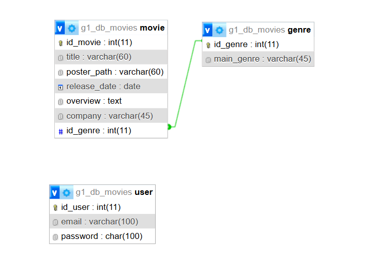

# TPE_WEB2_MOVIES
 Integrantes:
   Nombre: Ian Agustin Valerioti  email: agustinvalerioti@gmail.com
   Nombre: Hiese Maria Belen    email: BelenHiese16@hotmail.com

Tematica: Pagina de Peliculas 
Esta página está dedicada a los amantes del cine. Su propósito es ofrecer un espacio completo donde los usuarios puedan descubrir películas de todos los géneros y épocas.
Cada título contará con su sinopsis detallada, permitiendo conocer la trama antes de verla, y con reseñas honestas y variadas, que ayudarán a decidir si vale la pena sumergirse en la historia.

DER: 
En nuestro diagrama de entidad de datos, se muestran items (peliculas) y a que categoria pertenecen (generos). A su vez dejamos la tabla que contiene al administrador a la vista para su futuro uso.

Acesso a administrador : Usuario: web@admin.com
                         Contraseña: admin

Public access: 
El usuario podra ver las peliculas listadas, al tocar el titulo, la pagina le ofrecera una informacion detallada, podra acceder a tambien un listado de generos de peliculas-.

Admin: El administrador podra editar, agregar o eliminar cualquier pelicula con su respectivo genero.

Como desplegar el sitio.

1. Iniciar apache y phpMyAdmin.
2. 2.Clonar el repositorio "https://github.com/BelenHiese/TPE_WEB2_MOVIES.git" dentro de la carpeta C:/xammp/htdocs.
3. En el browser iniciar localhost/phpMyAdmin

   Crear una DB con nombre "g1_db_movies" vacio.
   El sitio crea y completa las tablas en la DB.
   En el browser ingresar "localhost/TPE_WEB2_MOVIES-main"
